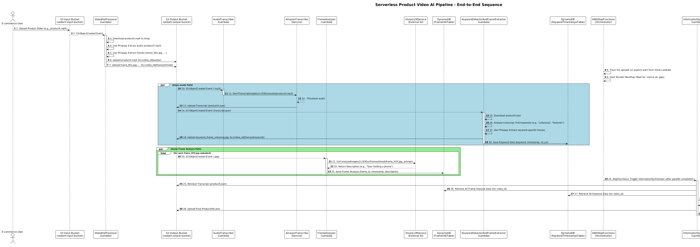

# AI-Powered-Product-Description-Service

## Overview
Brief description of your project.

## Architecture

## Low-Level Design Document

### 1. Introduction

#### 1.1 Purpose
The purpose of this LLD document is to describe the detailed design of the Serverless Product Video AI Pipeline, specifying the modules, classes, methods, and data structures required for implementation. It serves as a blueprint for developers during the coding phase.

#### 1.2 Scope
This document covers the low-level design aspects of the Serverless Product Video AI Pipeline. The high-level architecture and overall system design will be finalized later.

#### 1.3 AWS Services & Components
- **Amazon S3**: Primary storage and event trigger mechanism.
  - `vedant-input-bucket`: Entry point for user-uploaded raw videos.
  - `vedant-output-bucket`: Central hub for processed assets and final output JSON.
- **AWS Lambda**: Serverless compute layer for business logic.
  - All functions in Python, triggered by S3 events or Step Functions.
- **AWS Step Functions**: Orchestrator for workflow and task sequencing.
- **Amazon Transcribe**: Converts speech to text from audio files.
- **LLM APIs**: Vision-enabled and text-based LLMs for analysis and synthesis.
- **Amazon DynamoDB**: NoSQL database for intermediate and final data.

### 2. System Overview
Event-driven system automating product description generation from uploaded videos using AWS serverless technologies and external AI services. Orchestrated by Step Functions.

### 3. Module Design

#### 3.1 VideoPreProcessor
- **Purpose**: Downloads raw video, extracts audio and frames, uploads to S3.
- **Dependencies**: S3, FFmpeg (Lambda Layer), Boto3.
- **API**: `lambda_handler(event, context)`.

#### 3.2 AudioTranscriber
- **Purpose**: Initiates transcription job with Amazon Transcribe.
- **Dependencies**: S3, Transcribe, Boto3.
- **API**: `lambda_handler(event, context)`.

#### 3.3 FrameAnalyzer
- **Purpose**: Analyzes frame images using Vision LLM, saves to DynamoDB.
- **Dependencies**: S3, Vision LLM API, DynamoDB, Boto3.
- **API**: `lambda_handler(event, context)`.

#### 3.4 KeywordDetectorAndFrameExtractor
- **Purpose**: Detects keywords in transcript, extracts frames, saves to DynamoDB.
- **Dependencies**: S3, FFmpeg, DynamoDB, Boto3.
- **API**: `lambda_handler(event, context)`.

#### 3.5 InformationSynthesizer
- **Purpose**: Synthesizes final product description using Text LLM.
- **Dependencies**: S3, DynamoDB, Text LLM API, Boto3.
- **API**: `lambda_handler(event, context)`.

### 3.6 Class Diagram

### 3.7 Sequence Diagrams

## License
Project license information.